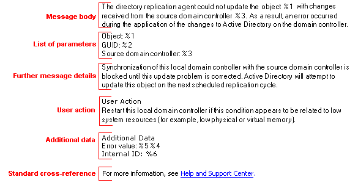

# EventLogMonitor
EventLogMonitor is a tool that allows you to view and tail events from the Windows Event Log at the command line.

This tool was originally written around 10 years ago to work with the IBM WebSphere Message Broker product and subsequent releases, and this is reflected in some of the defaults the tool still uses today. However, it also can be used to monitor events written by any program that writes to the Event Log.

## Installation
No real installation is required - simply unzip the download and copy the **EventLogMonitor.exe** application and **EventLogMonitor.pdb** into a folder on your path. There are two versions of the tool to choose from
* a "smaller" **EventLogMonitor-vX-without-framework.zip** version that requires that you have the [.NET 6 Runtime framework](https://dotnet.microsoft.com/en-us/download/dotnet/6.0) installed as a pre-req.
* a "larger" **EventLogMonitor-vX-with-framework.zip** version that is self-contained and does not require any pre-reqs.

 Simply pick the latest version that matches your environment from the [releases](https://github.com/m-g-k/EventLogMonitor/releases) page on GitHub. The functionality of both versions is the same.

## Usage 
There are three different ways to use this tool. The first is to simply query all events from the Application Event Log like this:

`EventLogMonitor.exe -s *` 

this should give you the following output: 

`Waiting for events from the Application log matching the event source '*'. ` 
`Press <Enter>, 'Q' or <Esc> to exit or press 'S' for current stats...` 

As you can see this is automatically tailing the Application event log, waiting for events to be written from any event source. You can narrow down the sources if necessary to avoid seeing events that are not relevant to you by specifying them instead of the asterisk like this: 

`EventLogMonitor.exe -s Firefox` 
`Waiting for events from the Application log matching the event source 'Firefox'.` 
`Press <Enter>, 'Q' or <Esc> to exit or press 'S' for current stats...` 

As you can see this is now waiting for events written by the event source "Firefox". Note that the source is a lazy match and does not have to be exact. As long as the source contains the string you specify then it will be considered a match. Note that this string is case sensitive.

## Waiting for events from multiple sources
You can specify multiple sources by separating them with a comma (`,`) like this: 

`EventLogMonitor.exe -s Firefox,edge` 
`Waiting for events from the Application log matching the event source 'Firefox' or 'edge'.` 
`Press <Enter>, 'Q' or <Esc> to exit or press 'S' for current stats...`

If you need to specify a source name that has spaces you can enclose the string in quotes like this: 

`EventLogMonitor.exe -s "Firefox Default Browser Agent,edge"` 
`Waiting for events from the Application log matching the event source 'Firefox Default Browser Agent' or 'edge'.` 
`Press <Enter>, 'Q' or <Esc> to exit or press 'S' for current stats...`

Note that the search performed is a case sensitive partial match, so as long as the string specified with `-s` is present in the full event source name then it will match.

## Choosing the Event Log to view
You can choose the log to view by specifying the log name with `-l`. To change from viewing the default `Application` log to view the `System` log, you would run: 

`EventLogMonitor.exe -l System` 
`Waiting for events from the System log matching the event source '*'.` 
`Press <Enter>, 'Q' or <Esc> to exit or press 'S' for current stats...`

Of course, you can also combine `-l` with `-s` as you would expect to view a specific source or multiple sources from the chosen log.

## Viewing previous events in an Event Log
When starting to tail a log it is often useful to view a few previous entries that have already been written to the log to understand what has already happened before new events start to appear. This also helps to make sure you have spelt your event source name correctly. To do this we use the `-p` option to display previous events along with a count of how many events should be displayed like this: 

`EventLogMonitor.exe -s SPP -p 2` 
**16394I:** `Offline downlevel migration succeeded.` **`[23/01/2022 16:49:56.228]`** 
**16384I:** `Successfully scheduled Software Protection service for re-start at 2121-12-30T16:50:27Z. Reason: RulesEngine.` **`[23/01/2022 16:50:27.196]`** 

This time the output is different. Here we can see that two previous events have been written from the `Security-SPP` log before the terminal stops to wait for new events to be written. You would also see that the event numbers are colour coded to allow us to easily identify problems. 

* **Information** event numbers are written in green. They are also suffixed with the letter `I` for easy identification.
* **Warning** event numbers are written in yellow. They are also suffixed with the letter `W` for easy identification.
* **Error** event numbers are written in red. They are also suffixed with the letter `E` for easy identification.  
* **Critical** event numbers are written in dark red. They are also suffixed with the letter `C` for easy identification.  

We can also see that the timestamp showing when the events were first written to the log is shown at the end in **bold**. If we prefer we can choose to write the timestamp at the beginning of the event's output rather than at the end by specifying the `-tf` or "timestamp-first" option: 

`EventLogMonitor.exe -s SPP -p 2 -tf` 
**`23/01/2022 16:49:56.228`**`:` **16394I:** `Offline downlevel migration succeeded.` 
**`23/01/2022 16:50:27.196`**`:` **16384I:** `Successfully scheduled Software Protection service for re-start at 2121-12-30T16:50:27Z. Reason: RulesEngine.` 

At this point we can leave the terminal open and wait for more events to appear or press `<Enter>, 'Q' or <Esc>` to stop waiting and quit. We can also press `S` to see the statistics on how many events have been written so far: 

`...` 
`2 Entries shown so far from the Application log. Waiting for more events...`

Note that we can choose to display all previous events by using `-p *`.

## Displaying available Event Logs
Another way to use this tool is to see what event logs are registered on the system using the `-d` "display-logs" option to output a list of all registered logs: 

`EventLogMonitor.exe -d` 
**`LogName : Entries : LastWriteTime : [DisplayName]`** 
**`-------------------------------------------------`** 
**`Windows PowerShell`**` : 8452 : 23/01/2022 16:47:54 : [Windows PowerShell]` 
**`System`**` : 39157 : 23/01/2022 16:54:56 : [System]` 
**`Lenovo-Power-BaseModule/Operational`**` : 505 : 23/01/2022 13:31:48 : [Lenovo-Power-BaseModule]` 
`...` 
`Some providers maybe ignored (not Admin).` 
`141 Providers listed.`

Here we can see that on this system we have over 141 providers listed, although some additional ones may not have been shown as we were not running this command prompt "elevated" and some logs can only be accessed as an Administrator. If we re-run this command from an elevated prompt, we can see more providers listed.

By default, this output shows the key pieces of information about each log provider - the log's name, the number of events in the log and when the last entry was written along with a display name which is sometimes different to the log name.

However, this command will ignore all logs that have zero entries in them. If you want to list every log, including those with no entries, you need to add the `-v` or "verbose" option which also shows extra information about each log: 

`EventLogMonitor.exe -d -v` 
**`Windows PowerShell`** 
&emsp;&emsp;`DisplayName:  Windows PowerShell` 
&emsp;&emsp;`Records:      8452` 
&emsp;&emsp;`FileSize:     15732736` 
&emsp;&emsp;`IsFull:       False` 
&emsp;&emsp;`CreationTime: 26/09/2020 21:29:27` 
&emsp;&emsp;`LastWrite:    23/01/2022 16:47:54` 
&emsp;&emsp;`OldestIndex:  209938` 
&emsp;&emsp;`IsClassic:    True` 
&emsp;&emsp;`IsEnabled:    True` 
&emsp;&emsp;`LogFile:      %SystemRoot%\System32\Winevt\Logs\Windows PowerShell.evtx` 
&emsp;&emsp;`LogType:      Administrative` 
&emsp;&emsp;`MaxSizeBytes: 15728640` 
&emsp;&emsp;`MaxBuffers:   64` 
**`System`** 
&emsp;&emsp;`DisplayName:  System` 
&emsp;&emsp;`Records:      39157` 
&emsp;&emsp;`FileSize:     20975616` 
&emsp;&emsp;`IsFull:       False` 
&emsp;&emsp;`...` 

If you need to find a log and know a few characters from its name, you can filter the output by adding the `-l` option. For example, to show only those logs that contain the word `App` we can do this: 

`EventLogMonitor.exe -d -l app` 
**`LogName : Entries : LastWriteTime : [DisplayName]`** 
**`-------------------------------------------------`** 
**`Application`** `: 55221 : 23/01/2022 17:39:26 : [Application]` 
**`Microsoft-Windows-Shell-Core/AppDefaults`** `: 720 : 23/01/2022 13:46:39 : [Microsoft-Windows-Shell-Core]` 
**`Microsoft-Windows-Security-LessPrivilegedAppContainer/Operational`** `: 2075 : 23/01/2022 14:47:48 : [Microsoft-Windows-Security-LessPrivilegedAppContainer]` 
**`Microsoft-Windows-AppxPackaging/Operational`** `: 1946 : 23/01/2022 14:32:00 : [Microsoft-Windows-AppxPackagingOM]` 
**`Microsoft-Windows-AppXDeploymentServer/Operational`** `: 4594 : 23/01/2022 15:37:49 : [Microsoft-Windows-AppXDeployment-Server]` 
**`Microsoft-Windows-AppXDeployment/Operational`** `: 2061 : 23/01/2022 17:38:00 : [Microsoft-Windows-AppXDeployment]` 
**`Microsoft-Windows-AppReadiness/Operational`** `: 886 : 23/01/2022 14:32:00 : [Microsoft-Windows-AppReadiness]` 
**`Microsoft-Windows-AppReadiness/Admin`** `: 2529 : 23/01/2022 14:32:00 : [Microsoft-Windows-AppReadiness]` 
**`Microsoft-Windows-AppModel-Runtime/Admin`** `: 1535 : 23/01/2022 17:38:22 : [Microsoft-Windows-AppModel-Runtime]` 
**`Microsoft-Windows-Application-Experience/Program-Telemetry`** `: 1537 : 23/01/2022 14:47:48 : [Microsoft-Windows-Application-Experience]` 
**`Microsoft-Windows-Application-Experience/Program-Compatibility-Assistant`** `: 337 : 23/01/2022 15:47:49 : [Microsoft-Windows-Application-Experience]` 
**`Microsoft-Windows-Application Server-Applications/Operational`** `: 1 : 19/02/2021 16:01:59 : [Microsoft-Windows-Application Server-Applications]` 

`Some providers maybe ignored (not Admin).` 
`12 Providers listed.` 

Now we can see by specifying `-l app` we have cut down the output from over 141 log providers to just 12. Note that we can specify multiple providers with a comma as in `-l "app, hyper"` or use an `*` to explicitly request all logs.

## Exporting Events using the Event Viewer
Sometimes it is necessary to export events from one machine into an `.evtx` file to view on a different machine. To do this, follow the [Exporting Events](docs/ExportingEvents.md) instructions.

## Viewing an exported log file
To view the events in an exported event log file, rather than an active event log, you use the `-l` option. For example: 

`EventLogMonitor -l c:\temp\WonderApp.evtx -p *` 
`...` 
`5 Entries shown from the c:\temp\WonderApp.evtx log matching the event source '*'.` 

Note that when using an event log file, the default is to show the entire contents of the log file. To show fewer entries use the `-p` option with a value, e.g. `-p 10`. Also note that tailing is automatically disabled when viewing a file. All the other options such as `-s`, along with the other viewing options, such as the filtering choices described below, work on event log files.

To see more examples of using event log files, look at some of the tests for EventLogMonitor which use exported log files extensively to ensure consistent output.

When using event log files exported from a different machine there are two options to see the contents of the events:

1. If you have exported display information with the event log file, make sure you copy the `LocaleMetaData` folder and the `.MTA` files inside it along with the exported `.evtx` file to the viewing machine. In this case the `LocaleMetaData` folder must be in the same folder as the `.extx` file and the there must be an `.MTA` file with event display information that matches your current nachines display language in the folder. For more information see the [Exporting Events](docs/ExportingEvents.md) documentation.

2. An alternative to using `.MTA` files is to copy the message catalogue `.dll` (or `.exe` in a few cases) file from the source machine, to the one being used to read the log file, in order to be able to read the events properly. Simply place the `.dll` file into the same folder as the log file itself and rename it to have same name as the log file, but with a .dll extension. For example for, if you have an exported log in the temp folder called `c:\temp\WonderApp.evtx`, place the message catalogue dll into the `c:\temp` folder and call it  `c:\temp\WonderApp.dll`. EventLogMonitor will then use this file when reading the log to display the events. In this case the `LocaleMetaData` and the `.MTA` files are not needed and should not in the same folder as the `.evtx` file, as if both are present an `.MTA` file may take precedence.

Remember, an exported event log file cannot be tailed but you can use the `-s` option amongst others to view a subset of events in the log file.

## The type and shape of events
As documented in these rather old Microsoft MMC [guidelines](https://docs.microsoft.com/en-us/previous-versions/windows/desktop/bb226812(v=vs.85)), there are traditionally three main types of events that can be sent to the Event Log:
* "*Informational* events indicate that a task or operation has been completed successfully."
* "*Warning* events notify the user that a problem might occur unless action is taken."
* "*Error* events provide information about a problem that has occurred with a component or program."

Each of these event types has the same format as shown in this picture taken from the above guidelines:

Of this list of six parts, the most frequently used are:
1. **Message body** (or **Description**).
2. **Further message details** (or **Explanation**).
3. **User action**.

Of course all three of these may include what the picture calls the **List of parameters**. **Additional data** and **Standard cross-reference** are rarely seen and are included with the **User action** for our purposes.

EventLogMonitor always uses the **List of parameters** as part of the message formatting if they are present in the event.

## Controlling the output
The output from EventLogMonitor is customisable to some extent.

By default the tool tries to show one event per line. It does this by splitting the event into the three main sections shown above and only outputting the first, which is the **Message body**.

There are three options which control the amount of information shown in the output which are are `-1`, `-2` and `-3`. The `-1` option is the default and will only show the **Message body**. Specifying `-2` means that the output will include the **Message body** and the **Further details** section whereas specifying `-3` means all parts of the event will be shown including any **Additional data** or **Standard cross-reference** sections and provides the complete event information.

## Filtering the output
Some applications can produce a large amount of events in the Event Log and given that each application will normally use the same event source name you cannot use the `-s` source option to filter within a single event source and this is where the filter options come in. There are several filter options:

* `-fi` or "filter include".
* `-fx` or "filter exclude".
* `-fn` or "filter on event ID".
* `-fw` or "filter on warnings".
* `-fe` or "filter on errors".
* `-fc` or "filter on critical errors".

### "Filter Include"
`-fi` will output only those events that include the specified text in the message. Use quotes to include text that contains a space, for example: 

`EventLogMonitor.exe -p * -s <your source> -fi "your text here"` 

Note that this filter is applied after any `-2` or `-3` option.

### "Filter eXclude"
`-fx` will output only those events that do not include the specified text in the message. Use quotes to exclude text that contains a space, for example: 

`EventLogMonitor.exe -p * -s <your source> -fx "your text to exclude here"` 

Note that this filter is applied after any `-2` or `-3` option.

### "Filter on Event ID" 
`-fn` will output only those events that match the specified event ID filter. Allowed filters include:
* inclusive IDs like `55`, `1002`. This will display only events with a matching ID(s).
* exclusive IDs like `-11`, `-20`. This will display only events that do not match the specified ID(s).
* inclusive ranges like `100-200, 401-672`. This will display only events within the specified range(s).
* exclusive ranges like `-50-60, -700-907`. This will display only events that are not within the specified range(s).
* any combination of the above like `56,1003,100-200,-50-70,-89`

For example: 

`EventLogMonitor.exe -p * -s <your source> -fn 1,2,55-103,-60-70,-99` 

Note that if you only want to specify a negative ID or range you should use the `=` form to supply the parameter like this:  

`EventLogMonitor.exe -p * -s <your source> -fn=-99` 

Also, if you use spaces between the commas, then you should supply the values in quotes like this: 

`EventLogMonitor.exe -p * -s <your source> -fn "1, 2, 55 - 103, -60-70,-99"` 

In order to mix inclusive value and exclusive values in the same filter you also need to specify an inclusive range within which the exclusive values can be excluded. In the example shown above, we can see the range `55-103` is an inclusive range from which the range `-60-90` and the individual ID `99` can be excluded.

### "Filter on Warnings"
`-fw` will output only those events that are either a "warning", an "error" or "critical", for example: 

`EventLogMonitor.exe -p * -s <your source> -fw` 

### "Filter on Errors"
`-fe` will output only those events that are an "error" or "critical", for example: 

`EventLogMonitor.exe -p * -s <your source> -fe` 

### "Filter on Critical Errors"
`-fc` will output only those events that are a "critical Error". These types of errors are usually output by Windows into the System log when something happens like the machine reboots after losing power, for example: 

`EventLogMonitor.exe -p * -l System -fc` 

If necessary, the `-fi` and `-fx` options can be combined by specifying both options. If both are present, the `-fi` is always run first, then the `-fx` filter is run afterwards.

If more than one of `-fw`, `-fe` or `-fc` options are used together, then `-fc` takes precedence over `-fe` which takes precedence over `-fw`.

Note that when viewing previous events with the `-p` option, the `-fi` and `-fx` options are applied only to those events selected by the `-p`. This means that if you use `-p 5` for example then the filter will only be applied to the last 5 events matching the specified `-s` source. Therefore, it is possible no events will be displayed if the filter does not match. To determine if any previous event matches your filter it may be necessary to use a much larger value for `-p` or even use `-p *` to filter against all previous events in the chosen log.

### Filter Precedence
If multiple different filters types are used together, the precedence is:
1. `-fn`
2. `-fc`
3. `-fe`
4. `-fw`
5. `-fi`
6. `-fx`

## Binary data output
Some events will include diagnostic binary data as part of the event. This will often be ASCII or Unicode text data but may also include pointers or a raw memory dump. To facilitate the viewing of this information, you can use the `-b1` flag to view any binary data contained with an event as ASCII or Unicode text: 

`EventLogMonitor.exe -p * -s <your source> -b1` 

By default the `-b1` option is automatically applied to any error level event that is output. For example: 

`EventLogMonitor.exe -s VSS -p 2` 

**8224I:** `The VSS service is shutting down due to idle timeout. [19/12/2021 05:04:48.302]` 
**8193E:** `Volume Shadow Copy Service error: Unexpected error calling routine QueryFullProcessImageNameW.  hr = 0x8007001f, A device attached to the system is not functioning. [19/12/2021 20:54:45.365]` 
**`- Code: SECSECRC00000581- Call: SECSECRC00000565- PID:  00032976- TID:  00002904- CMD:  C:\WINDOWS\system32\vssvc.exe   - User: Name: NT AUTHORITY\SYSTEM, SID:S-1-5-18. Index: 277479`** 

In the example above the last line in bold shows an example of the automatic application of the `-b1` option for an error event. If the event did not have any binary data, the last line would instead look like this: 

`<Entry has no binary data>. Index: 315903` 

Alternatively if the event had binary data that was not detected as ASCII or Unicode, then the last line would be: 

`<Entry has binary data - use '-b2' to view>, Index: 315903` 

This message indicates that there is binary data to look at, but you need to use the `-b2` option instead to view it as a hexdump.

Note that the event index is always shown.

To view binary data as a hex dump instead of text, use the `-b2` option: 

`EventLogMonitor.exe -s Restore -p 1 -b2` 
**8216I:** `Skipping creation of restore point (Process = C:\WINDOWS\winsxs\amd64_microsoft-windows-servicingstack_31bf3856ad364e35_10.0.19041.1371_none_7e1bd7147c8285b0\TiWorker.exe -Embedding; Description = Windows Modules Installer) as there is a restore point available which is recent enough for System Restore.` **`[19/01/2022 22:12:10.528]`** 
`Binary Data size: 36` 
`Count   : 00 01 02 03-04 05 06 07  ASCII         00       04` 
`00000008: 00 00 00 00-55 02 00 00 ....U... 00000000 00000255` 
`00000016: 4B 02 00 00-00 00 00 00 K....... 0000024B 00000000` 
`00000024: 22 CE 28 67-7c 6d da 79 ".(g|m.y 6728CE22 79DA6D7C` 
`00000032: E2 8C 1C 00-00 00 00 00 ........ 001C8CE2 00000000` 
`00000036: 00 00 00 00             ....     00000000` 
`Index: 311242` 

Both binary options (`-b1` and `-b2`) also output the index value for the event which can be used to view more information about the event, for example by adding the `-3` or `-v` options in conjunction with the `-i` option. See the [Using Event Indexes](#indexes) section below for more details.

All data written by the binary options is coloured in blue for easy identification.

## Verbose output
In addition to the information output choices above, there is another `-v` "verbose" output option that will add some extra information for each event. The `-v` option output will always contain information for:

* `Machine`: The name of the machine  where the event was originally written. This can be useful when viewing an event log file on a different machine.
* `Log`: The name of the log that contains this event.
* `Source`: The name of the source that output this event. This is useful when using `-s *` to see what source each event belongs to.

In addition, some extra information will be output if it is present in the event, however many events do not contain this information:

* `User`: The SID for the user which was running the process that output this event.
* `ProcessId`: The ID of the process that output this event.
* `ThreadId:` The ID of the thread within the process that output this event.
* `Version:` The version of the event if the version is greater than zero.
* `Win32Msg:` Output only in certain cases. See the [Viewing events without message catalogues](#no-catalogue) section for more details.

For example: 

`EventLogMonitor.exe -p 1 -s Restart -v` 
**10001I**`: Ending session 0 started 2022 - 01 - 25T00:19:00.327747000Z.` **`[25/01/2022 00:19:13.447]`** 
`Machine: Rivendell. Log: Application. Source: Microsoft-Windows-RestartManager. User: S-1-5-18. ProcessId: 33476. ThreadId: 40936.` 

All data written by the `-v` option is coloured in dark grey for easier identification.

## Using event indexes 
Yet another way to use this tool is to query specific events by index with the `-i` or index option. This allows you to output events by index rather than by type. Every event written to an event log has an index number that is put into the event when it is written. Events with higher numbers occurred after events with lower numbers and in the normal case are usually consecutive within a given log. The `-i` option on its own will output the single event with that number, assuming one exists. For example: 

`EventLogMonitor.exe -i 123456` 

This will output the event with the index `123456` assuming an event with that index exists. You can also specify a range of events to be output by specifying the beginning and end of the range, separated with a `-`. For example: 

`EventLogMonitor.exe -i 123456-123460` 

This will output the five events, `123456`, `123457`, `123458`, `123459` and `123460` assuming they exist. If events are missing from the range they are simply ignored and specifying an empty range will simply produce no events. When using a range, the end of the range must have a higher value than the beginning of the range.

We can also specify a single index and use the `-p` option to specify a number of events before and after the indexed event to output as well. For example: 

`EventLogMonitor.exe -i 123456 -p 3` 

This will output 3 events immediately before the indexed event (if they exist) and 3 events after and is essentially a faster way of specifying a range of events to output.

This can be especially useful when you are monitoring the event log for an application with `-s` and an error event is emitted. In this case, the event's index will also be output as part of the error event which allows you to take the index and run the tool with a `-p` value, for example `-p 10` and see the ten events immediately before and after the event that had the error. Because the event is specified by index, any `-s` (source) is ignored and events from all sources are displayed. This could allow you to see if another application wrote a message that had a bearing on your application's error.

Note that when using indexes to access events the "tailing" functionality is automatically disabled, and the command will complete once it has output the specified events.

## Redirecting the output
The tool supports redirecting the output to a file with the standard shell redirect. For example: 

`EventLogMonitor.exe -p 5 -s * > c:\temp\logoutput.txt` 

When redirecting output to a file, you can still press `<Enter>`, `'Q'` or `<Esc>` to exit or press `'S'` for current stats, although the stats output message will also be redirected to the file.

## Viewing output in a different language
You can use the `-c <culture>` option to change the culture (or language) used to output the language. Any valid culture is allowed as long as the message catalogue for the event contains the message in the chosen language. The values should be specified as strings which is the prefered usage. However, they can also be specified as as decimal or as hex LCID values if required for testing. Valid values for `-c` include:
* `De-DE` or `1031` or `0x407` for German
* `En-GB` or `2057` or `0x809` for English (United Kingdom)
* `En-US` or `1033` or `0x409` for English (United States)
* `Es-ES` or `3082` or `0xC0A` for Spanish
* `Fr-FR` or `1036` or `0x40C` for French
* `It-IT` or `1040` or `0x410` for Italian
* `Ja-JP` or `1041` or `0x411` for Japanese
* `Ko-KR` or `1042` or `0x412` for Korean
* `Pl-PL` or `1045` or `0x415` for Polish
* `Pt-BR` or `1046` or `0x416` for Portuguese (Brazil)
* `Ru-RU` or `1049` or `0x419` for Russian
* `Tr-TR` or `1055` or `0x41F` for Turkish
* `Zh-CN` or `2052` or `0x804` for Chinese (Simplified)
* `Zh-TW` or `1028` or `0x404` for Chinese (Traditional)

Note that you may need to use a Unicode font to be able to display certain languages in your terminal.

## Viewing events without message catalogues 
If the message catalogue for an event cannot be found, or the catalogue does not contain an entry for the event in question, a default message is output instead. Normally that message looks similar to the one output by the Event Viewer built into Windows in this situation: 

**0I**`: The description for Event ID 0 from source XYZ cannot be found. Either the component that raises this event is not installed on your local computer or the installation is corrupted. You can install or repair the component on the local computer. [25/01/2020 20:30:25.632]` 

However, on occasion, when viewed in the Windows Event Viewer you will actually something like this instead: 

`The operation completed successfully.` 

for an event ID of 0.

or this:

`Incorrect function.` 

for an event ID of 1.

or even:

`The system cannot find the path specified.` 

for an event ID of 3.

What is happening here is that if the Event Viewer detects that the event was written with a "qualifier" of zero (see [EventRecord.Qualifiers](https://docs.microsoft.com/en-us/dotnet/api/system.diagnostics.eventing.reader.eventrecord.qualifiers?view=dotnet-plat-ext-6.0#system-diagnostics-eventing-reader-eventrecord-qualifiers)) it tries to convert the event ID into a Win32 error message. If that conversion is sucessful then the Win32 error message that corresponds to the event ID is output instead of the default error message shown above. Whilst this approach means the event viewer output contains fewer error messages like the one above, it can be misleading in many cases as the Win32 message may not match the event. Therefore, EventLogMonitor chooses to always output the original error message instead which more acurately reflects the situation. However, if you also use the `-v` "verbose" option then you will see an extra entry on the verbose output line for the `Win32Msg` in this case: 

`Machine: mgk-PC3. Log: Application. Source: Firefox Default Browser Agent. Win32Msg: The operation completed successfully. (0).` 

or perhaps:

`Machine: mgk-PC3. Log: Application. Source: iBtSiva. Win32Msg: The system cannot find the path specified. (3).` 

Of course the exact message shown will reflect the actual event ID. This allows you to see the same information in EventLogMonitor that you do in the Event Viewer.

## Viewing the Security log
The `Security` log can be viewed like any other log by specifing it's name with the `-l` option: 

`EventLogMonitor.exe -l Security` 

However, you must run this command from an elevated command prompt or you will get an error: 

`Attempted to perform an unauthorized operation.` 
`Run from an elevated command prompt to access the 'Security' event log.` 

Once your prompt is elevated then all the other options like `-p` and `-3` etc, work just the same against the `Security` log. The main difference between the `Security` and other logs is that rather than using `Information`, `Warning` and `Error` for the categories of events, it uses `Audit Success` and `Audit Failure`. These are represented as follows:

* **Audit Success** event numbers are written in green. They are also suffixed with the letter `S` for easy identification.
* **Audit Failure** event numbers are written in red. They are also suffixed with the letter `F` for easy identification.  

## Miscellaneous options
There are a final few options that have not been covered elsewhere. These are:
* `-nt` or "No Tailing". If you are only wanting to view existing events, specifying `-nt` will stop the tool tailing the log at the end of the output.
* `-utc`. Display the event timestamp in UTC time rather than converting it to local time. Local time conversion is the default.
* `-?` or `-help`. The help commands produce a simplified version of this readme.
* `-version`. Displays the version of the EventLogMonitor tool being run.

## Options list
To see all the options, ask for help: 

`EventLogMonitor -?` 

Note that all the options also support a `/` as well as a `-`: 

`EventLogMonitor /?` 

## Specifing arguments
In most cases arguments can simply be supplied with a space between the flag and the argument. However, it is also possible to use `=` as a separator instead. This means that these two commands are the same: 

`EventLogMonitor.exe -s SPP -p 2` 

and 

`EventLogMonitor.exe -s=SPP -p=2` 

The `=` form is most useful when providing `exclusive` event ID filters, see [Filter on Event ID](#FilterOnEventId) for an example.

## IBM events
If you run the tool without any options at all, you will see that the default is to look for entries from the various names for the **IBM App Connect Enterprise** product: 

`EventLogMonitor` 
`Waiting for events from the Application log matching the event source 'IBM Integration' or 'WebSphere Broker' or 'IBM App Connect Enterprise'.` 
`Press <Enter>, 'Q' or <Esc> to exit or press 'S' for current stats...` 

As you can see it looks for the most recent three names by which the product's event log entries have been known. One other small change the tool makes is when it outputs an entry that belongs to one of these products it will prefix the event ID with the letters `BIP` to match the products message naming convention.

However, if you are not using this tool with any of these products, simply override these defaults with the `-s` flag as described above in the [Usage](#usage) section.

## License
The source code files are made available under the Apache License, Version 2.0 (Apache-2.0), located in the [LICENSE](https://github.com/m-g-k/EventLogMonitor/blob/main/LICENSE) file.

## Questions, suggestions and problems
Please create any [issues and suggestions on GitHub](https://github.com/m-g-k/EventLogMonitor/issues).
