# Exporting Events from the Windows Event Viewer

Exporting events should be a simple process. However, it is not always obvious how to get consistent results when trying to view those events, especially on a different machine. This guide tries to cover the basics and gives some tips on how to get the best results.

## Selecting the Events

There are two options when choosing what events to export. Firstly, you can export one or more individual events by clicking on the events or use shift and/or alt to multi select several events. Once selected, right click and choose "**Save Selected Events...**".

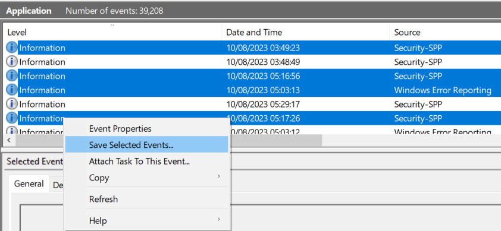

Secondly you can export an entire event log, such as `System` or `Application` by right clicking on the log name in the tree view on the left and choosing "**Save all Events As...**".

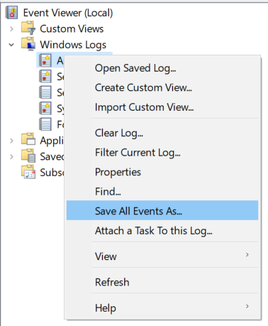

Choosing either option will take you to the "**Save As**" dialogue box. Note that for the second option, if you have applied a *filter* to the log then the option will be called "**Save Filtered Log File As...**".

## Saving the Events

In the "**Save As**" dialogue box choose a folder and enter a name to call your exported log. Note that it is always a good idea to create a new empty folder to save the log into, as a subfolder will normally be created that is easy to miss if the folder is not empty. Then make sure **Event Files (*.evtx)**" is selected in the "**Save as type**" option at the bottom of the screen and choose "**Save**".

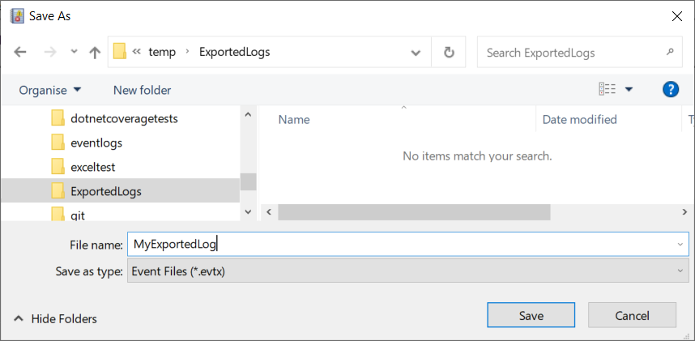

## Choosing the Display Information

Next the "**Display Information**" dialogue will be shown. By default this will be set to save "**No display information**":

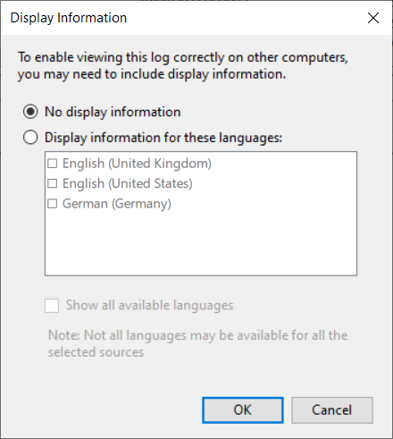

If you are planning to only read the exported events on the same computer or read them on a different computer that has the exact same versions of the software that generated the events installed, then this will work fine. However if you try to read log a file that was exported without display information on a computer without the correct message catalogues installed then you can expect to see an error message explaining that "*if the event originated on another computer, the display information had to be saved with the event.*":

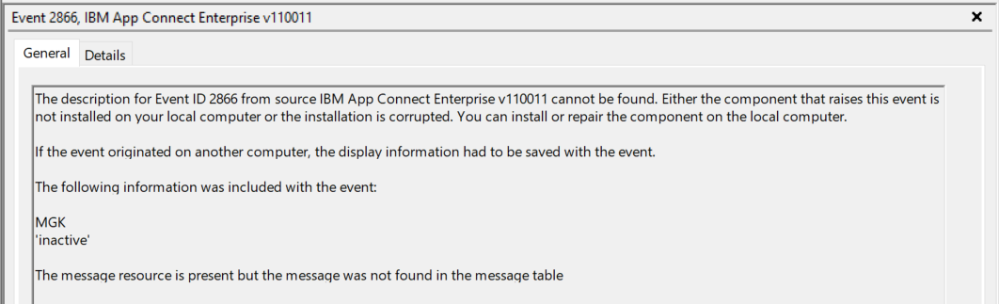

Therefore, it is almost always better to export the display information with the events, so we need to select the "**Display information for these languages:**" option and choose at least one of the installed languages that are shown:

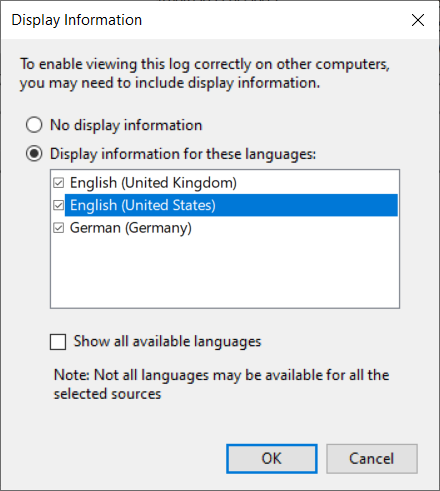

In this case **English (United Kingdom)**, **English (United States)**, and **German (Germany)** have been selected. It is often misunderstood that the languages shown are the ones that are available in the message catalogue, but this is not the case. Instead, it is actually the languages installed on the current machine that are shown.

Therefore, there is no guarantee that the message catalogues for the events selected will actually contain messages in the chosen languages. Given this, it is normally best to make sure **English (United States)** is always selected if it is present as this is the most common language for events to be present in. Of course, any other language can always be selected alongside the US one.

## Choosing Other Languages

It may be the case that **English (United States)** is not shown if it is not installed on your system, or maybe you know that the application whose events you are exporting actually has other languages that are not shown in the dialogue. In which case you need to select the **Show all available languages** check box:

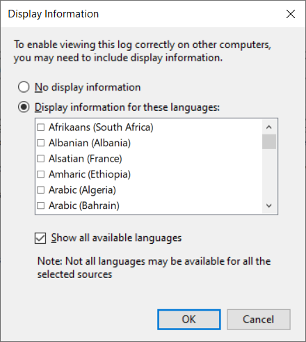

Once selected a new long list of languages appears - at the time of writing nearly 260 languages were listed. Be warned that any previously chosen languages such as the English and German shown above will have been automatically deselected and will need to be chosen again from the new list.

From this list you can choose from many different languages. However, there is no guarantee that a language chosen will be present in the message catalogue for the exported events and unfortunately the export process will allow you to choose languages that are not present in a message catalogue without any errors.

Once you have chosen one or more languages, ideally including **English (United States)**, you can click **OK** to complete the export process.

## Examining the Exported Artifacts

If you look in the folder, you exported into you will see the `.evtx` file. If you also chose to export display information, you will see a `LocaleMetaData` folder as well.

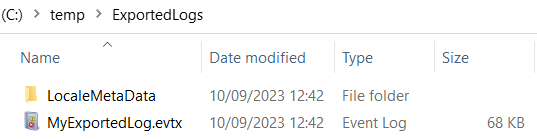

If we now look in the `LocaleMetaData` folder we will see several files containing the display information. There will be one file for each selected language, and they will be named `<ExportedLogName>_<LCID>.MTX`. In this example below we can see 14 files each with a different LocaleID (LCID) representing the 14 selected languages I chose when exporting the selected events:

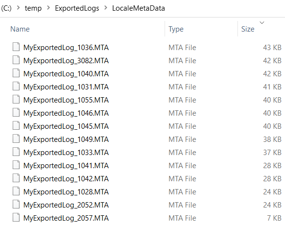

The LCID is the numeric identifier representing a particular language such as US English (1033), German (1031) and UK English (2057). [A full list of LCID's](https://learn.microsoft.com/en-us/openspecs/windows_protocols/ms-lcid/70feba9f-294e-491e-b6eb-56532684c37f) is provided by Microsoft. The latest version at the time of writing was `15.0` published on `06/25/2021` and contains a table of LCIDs starting on page 31. Note that the values in the document are in hex and need to be converted to decimal to match the values used in the file name.

## Export Problems

One of the problems with exported logs is where a language was selected for display, but the message catalogue does not contain messages in that language. In this case, the export creates an MTA file with the correct name but it does not contain any actual display messages. When trying to view messages using this locale you will get the error message shown above regarding *missing display information*. Apart from the missing display error, another way to tell there is a problem is to look at the size of the file. In the example above, the files in the `LocaleMetaData` folder are all over 20KB apart from `MyExportedLog_2057.MTA` which is approx 7KB. An MTA file this small is usually an indication that there is a problem unless you have only selected a small number of events to export. And in this case, as the original message catalogue does not contain messages in `en-GB`, an empty MTA file is created for this locale. This happens anytime a message catalogue for the events exported does not contain messages in the chosen language.

## Viewing the Exported .evtx File on the Same Machine

To view the exported `.evtx` in the **Event Viewer**, you may be able to simply double click on the `.evtx` file and it will open. This is because the application(s) that generated the exported events will be installed. However, this may fail in cases where a chosen display language was not present in the message catalogues for the exported events. In this case, the mere presence of the display language `.MTA` file will prevent the events from being displayed even if there is another `.MTA` file present that does have the message in. In the example above, **English (United Kingdom)** was selected, causing the file `MyExportedLog_2057.MTA` to be created. However. as it does not contain any events as the exported messages are not available in LCID 2057 opening the `.evtx` file will show errors for all the events. To prevent this, you would need to delete the `MyExportedLog_2057.MTA` and reopen the `.evtx` file, which is probably a bug in the Event Viewer.

## Viewing the Exported .evtx File on a Different Machine with the Application installed

To view the exported `.evtx` file in the **Event Viewer** on a different machine that also has the exact same application(s) that generated the events exported you should be able to simply double click on the `.evtx` file and it will open the same as if you were viewing the events on the machine they were exported from. However, be aware that even if the correct message catalogues are installed, an invalid `.MTA` file will cause the events to show errors as described above.

## Viewing the Exported .evtx File on a Different Machine without the Application installed

 To view the `.evtx` file on a different machine you must copy the entire contents of the exported information to the second machine and keep the folder structure intact. This means that it is usually easiest to zip up the folder you created when exporting the `.evtx` to transfer it along with the `LocaleMetaData` folder and `.MTA` files to the other machine.

 To view the exported `.evtx` file in the **Event Viewer**, your computer must be configured so that the LCID of the **Windows Display Language** matches one of the exported languages in the MTA files. If it does not, then the events will not display unless you delete the `.MTA` file that matches the missing display language.

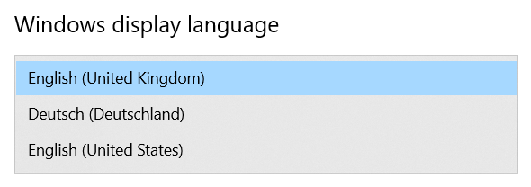

In the example above, the machine has three installed languages, UK English (LCID 2057), US English (LCID 1033) and German (LCID 1031), with UK English being the current default. This means that you must have a valid MTA file for UK English, such as `MyExportedLog_2057.MTA`. Without this you will see an error in the event viewer about missing display messages. In this case it may be simplest to just delete the `.MTA` file or rename a valid MTA file that you do have as described below.

## Fixing Missing Display Errors in the Event Viewer

If you have a missing display message error, you should first check your **Windows Display Language** LCID from a PowerShell terminal by running the `GET-WinSystemLocale` command:

```text
PS C:\temp> GET-WinSystemLocale

LCID             Name             DisplayName 
----             ----             ----------- 
2057             en-GB            English (United Kingdom)
```

Here we can see that UK English (2057) is the default and so **Event Viewer** will expect a `<log-name>_2057.MTA` file to exist. If there is no `<log-name>_<LCID>.MTA` file in your `LocaleMetaData` folder or there is a file that is very small as described above, you have a few options:

* If the missing language was not exported in the first place, and that language exists in the application's message catalog, simply go back to the machine where the export took place and re-export the events with the correct language selected.
* If the file is very small and you are seeing the missing display language error, it is likely the original application does not contain messages in your desired language. In this case you can delete the file and create a new one with the correct name from a different `.MTA` file that does exist. For example, if you have a US English (1033) `.MTA` file then you can simply rename this file to your expected LCID. In this case you would rename a `MyExportedLog_1033.MTA` file to be `MyExportedLog_2057.MTA`. Of course, this will not make the messages appear in your desired language, but it will make them appear in US English, or any other language that you have a valid MTA file for.
* The best option though would be to use the `EventLogMonitor` tool instead as this allows you to specify your desired language on the command line with the `-c` option for choosing a culture. For example, you could use:  
`EventLogMonitor.exe -l c:\temp\ExportedLogs\MyExportedLog.extx -c En-US`  
to display the events in US English or any other language that you have a valid MTA file for, or that exists in a message catalogue you have access to. See the [EventLogMonitor](https://github.com/m-g-k/EventLogMonitor#viewing-an-exported-log-file) docs for more details and to [download](https://github.com/m-g-k/EventLogMonitor/releases) the tool.

## Understanding the Event Viewer's Language Selection
The algorithm the Event Viewer uses to select the display language for a message is complex. This diagram tries to explain some of the complexity.

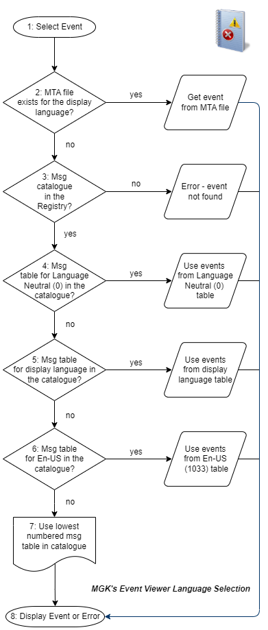

The steps in detail are:

1. The user opens an `.evtx` file and selects an event.
2. Event Viewer looks for a `.MTA` file that matches the user's **Windows Display Language**. For example, if the display language is **English (GB)** then it will look for a file called `MyExportedLog_2057.MTA` where `MyExportedLog` is the name of the exported `.evtx` file. If an `.MTA` with the right name exists it will open it to try and get the message for the selected event. If the event does not exist in the `.MTA` file, it will display the *missing display information* error message shown earlier.
3. If the `.MTA` file is not found it will look for an entry in the Windows registry for the application that created the event. If it does not find a correctly registered message catalogue it will display the *missing display information* error.
4. It will next look in the message catalogue for a message table with a Language Neutral message table which has the ID of zero (0). If it finds one, this will be used for the display information for the events.
5. It will next look in the message catalogue for a message table with an LCID that matches the **Windows Display Language**. If it finds one, this will be used for the display information for the events.
6. It will next look in the message catalogue for a message table with an LCID for `En-US` (1033). If it finds one, this will be used for the display information for the events.
7. It will next look in the message catalogue for a message table with the lowest LCID number. For example, it will choose 1031 over 1036 and 19 over both of these. Assuming at least one message table exists, the lowest numbered one will be used for the display information for the events. This can lead to events being shown in an unexpected language.
8. At this point either the message from the chosen message table will be shown or the *missing display information* error message will be displayed.

This information is a description of the behaviour observed whilst testing [EventLogMonitor](https://github.com/m-g-k/EventLogMonitor) and is a simplified version of the information shown in the [FormatMessage](https://learn.microsoft.com/en-us/windows/win32/api/winbase/nf-winbase-formatmessage) function API docs. If you can add any extra useful information or correct any mistakes, please [raise an issue on GitHub](https://github.com/m-g-k/EventLogMonitor/issues).
